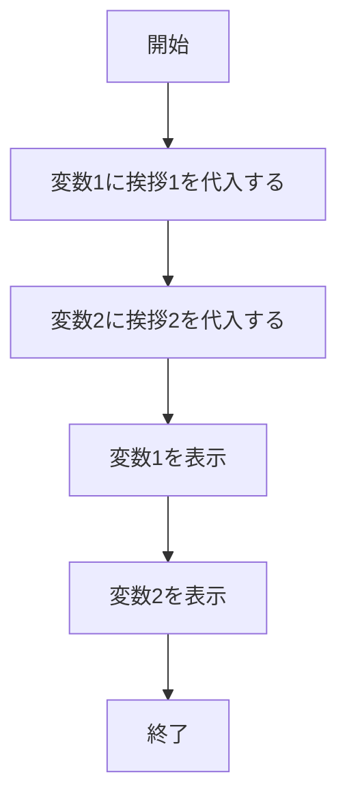
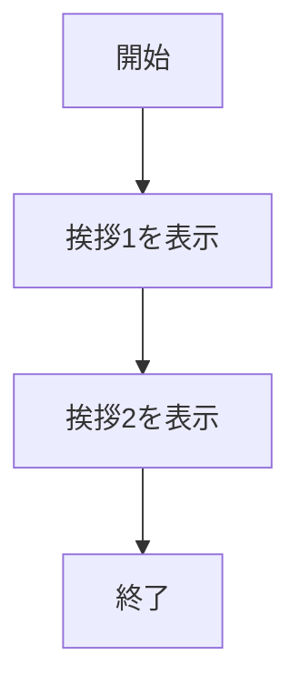
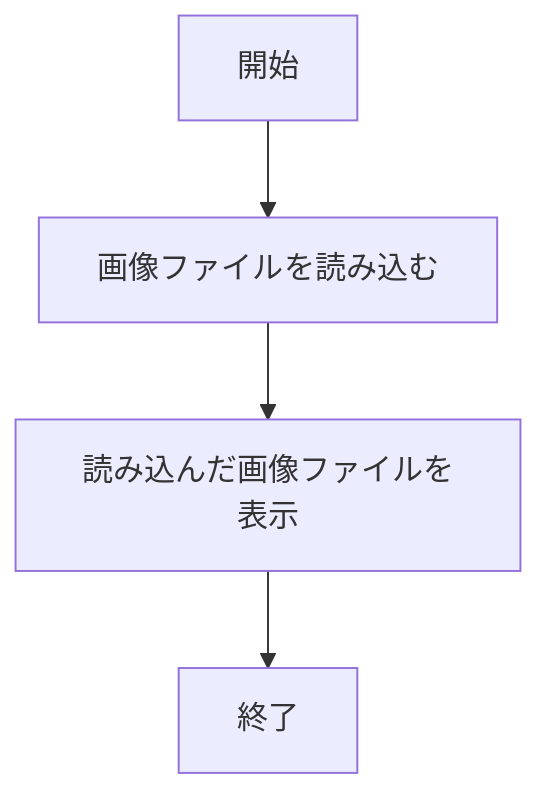
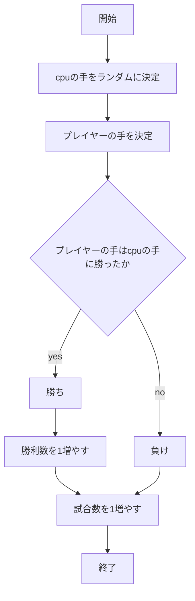
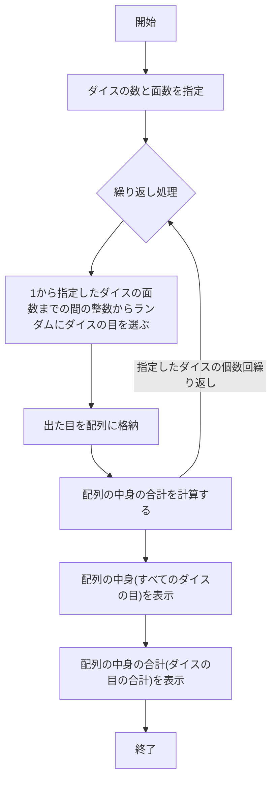
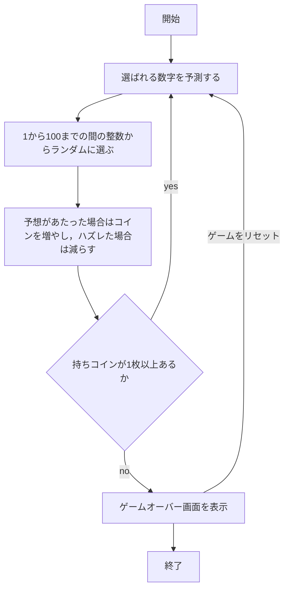

# hakkason
## フローチャート

```mermaid
flowchart TD;

start["開始"];
end1["終了"]
dainyuu1["変数1に挨拶1を代入する"]
dainyuu2["変数2に挨拶2を代入する"]
hennsuu1["変数1を表示"]
hennsuu2["変数2を表示"]

start --> dainyuu1
dainyuu1 --> dainyuu2
dainyuu2 --> hennsuu1
hennsuu1 --> hennsuu2
hennsuu2 --> end1
```

## フローチャート

```mermaid
flowchart TD;

start["開始"];
end1["終了"]
aisatu1["挨拶1を表示"]
aisatu2["挨拶2を表示"]

start --> aisatu1
aisatu1 --> aisatu2
aisatu2 --> end1
```

## フローチャート

```mermaid
flowchart TD;

start["開始"];
end1["終了"]
gazou["画像ファイルを読み込む"]
icon["読み込んだ画像ファイルを表示"]

start --> gazou
gazou --> icon
icon --> end1
```

## フローチャート

```mermaid
flowchart TD;

start["開始"];
end1["終了"]
cpu["cpuの手をランダムに決定"]
hito["プレイヤーの手を決定"]
if{"プレイヤーの手はcpuの手に勝ったか"}
win["勝ち"]
loose["負け"]
winsuu["勝利数を1増やす"]
total["試合数を1増やす"]

start --> cpu
cpu --> hito
hito --> if
if -->|yes| win
win --> winsuu
winsuu --> total
if -->|no| loose
loose --> total
total --> end1
```
## フローチャート

```mermaid
flowchart TD;

start["開始"];
end1["終了"]
sitei["ダイスの数と面数を指定"]
roll["1から指定したダイスの面数までの間の整数からランダムにダイスの目を選ぶ"]
dice["出た目を配列に格納"]
dices["配列の中身の合計を計算する"]
for{"繰り返し処理"}
hyouji1["配列の中身(すべてのダイスの目)を表示"]
hyouji2["配列の中身の合計(ダイスの目の合計)を表示"]

start --> sitei
sitei --> for
for --> roll
roll --> dice
dice --> dices
dices -->|指定したダイスの個数回繰り返し| for
dices --> hyouji1
hyouji1 --> hyouji2
hyouji2 --> end1
```
## フローチャート

```mermaid
flowchart TD;

start["開始"];
end1["終了"]
kake["選ばれる数字を予測する"]
roulette["1から100までの間の整数からランダムに選ぶ"]
syori["予想があたった場合はコインを増やし，ハズレた場合は減らす"]
if{"持ちコインが1枚以上あるか"}
over["ゲームオーバー画面を表示"]

start --> kake
kake --> roulette
roulette --> syori
syori --> if
if --> |yes| kake
if --> |no| over
over --> |ゲームをリセット| kake
over --> end1
```