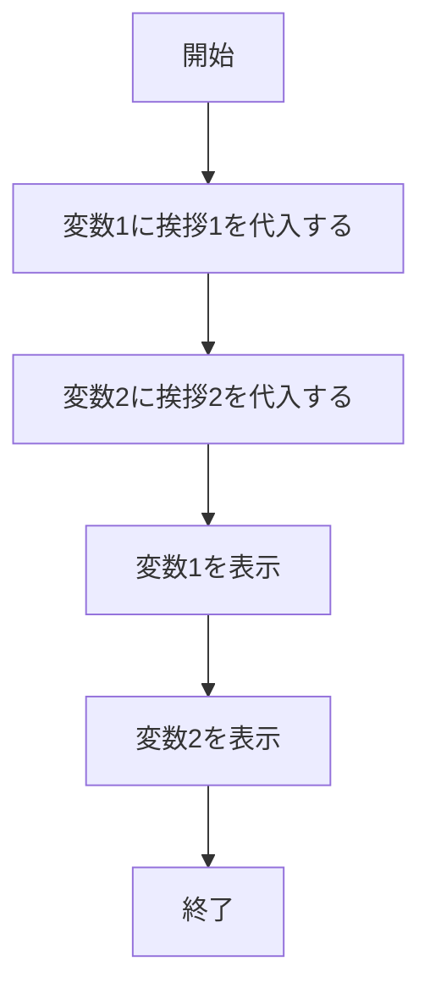

# hakkason
## フローチャート

```mermaid
flowchart TD;

start["開始"];
end1["終了"]
dainyuu1["変数1に挨拶1を代入する"]
dainyuu2["変数2に挨拶2を代入する"]
hennsuu1["変数1を表示"]
hennsuu2["変数2を表示"]

start --> dainyuu1
dainyuu1 --> dainyuu2
dainyuu2 --> hennsuu1
hennsuu1 --> hennsuu2
hennsuu2 --> end1
```