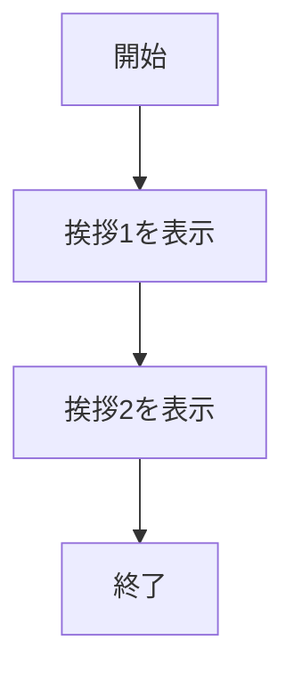
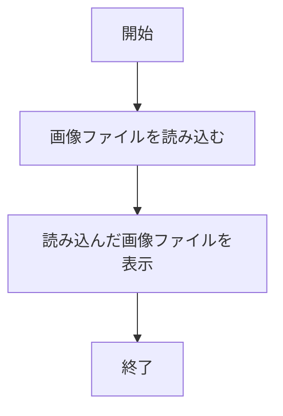
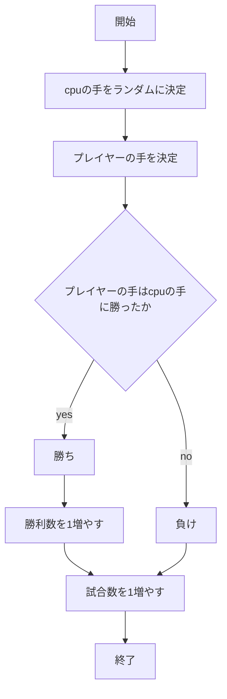
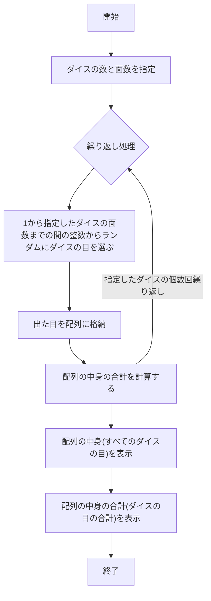
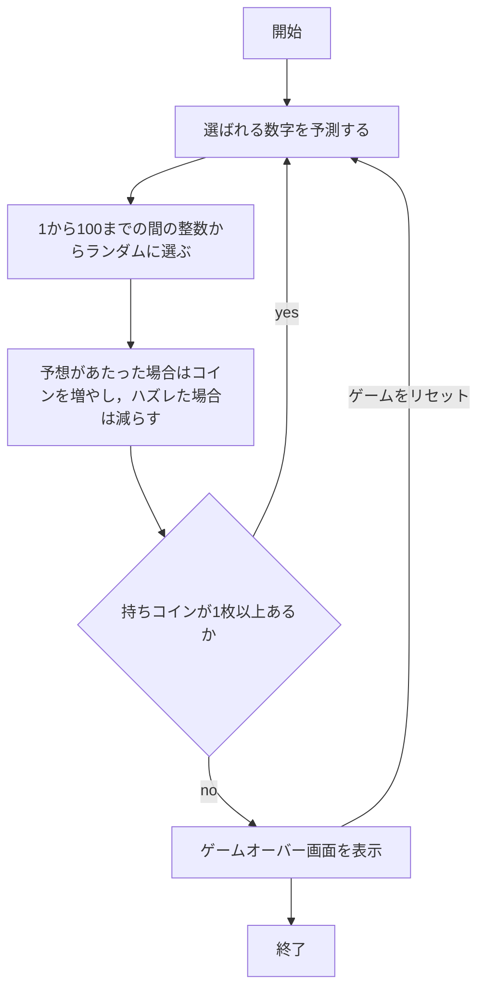

# hakkason
## フローチャート
```mermaid
flowchart TD;

start["開始"];
end["終了"]
jyusinn["音を受信"]
syuuha["受信した音の波から周波数を検知"]
if1{"送信開始の音を検知したか"}
yes1["検知した音に対応した4進数2bitを取得"]
kakuno["取得したデータを配列に格納"]
if2{"送信終了の音を検知したか"}

start --> jyusinn
jyusinn --> syuuha
syuuha --> if1
if1 -->|yes| yes1
if1 -->|no| jyusinn
yes1 --> kakuno
kakuno --> if2
if2 -->|yes| end
if2 -->|no| yes1
```

## フローチャート


## フローチャート


## フローチャート

## フローチャート

## フローチャート
