# hakkason
## 光送信
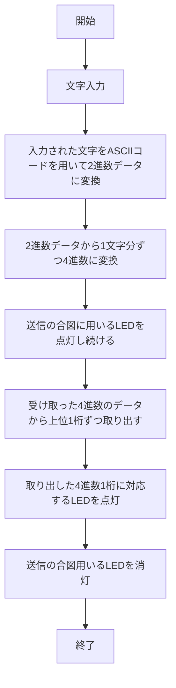
```mermaid
flowchart TD;

start["開始"];
end1["終了"]
nyu["文字入力"]
hen["入力された文字をASCIIコードを用いて2進数データに変換"]
hen2["2進数データから1文字分ずつ4進数に変換"]
aizu1["送信の合図に用いるLEDを点灯し続ける"]
toru["受け取った4進数のデータから上位1桁ずつ取り出す"]
syutu["取り出した4進数1桁に対応するLEDを点灯"]
aizu2["送信の合図用いるLEDを消灯"]

start --> nyu
nyu --> hen
hen --> hen2
hen2 --> aizu1
aizu1 --> toru
toru --> syutu
syutu --> aizu2
aizu2 --> end1
```

## 光送信2
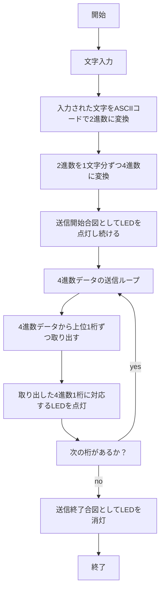
```mermaid
flowchart TD;

start["開始"]
end1["終了"]

nyu["文字入力"]
hen["入力された文字をASCIIコードで2進数に変換"]
hen2["2進数を1文字分ずつ4進数に変換"]
aizu1["送信開始合図としてLEDを点灯し続ける"]
loop1["4進数データの送信ループ"]
toru["4進数データから上位1桁ずつ取り出す"]
syutu["取り出した4進数1桁に対応するLEDを点灯"]
next["次の桁があるか？"]
aizu2["送信終了合図としてLEDを消灯"]

start --> nyu
nyu --> hen
hen --> hen2
hen2 --> aizu1
aizu1 --> loop1
loop1 --> toru
toru --> syutu
syutu --> next
next -->|yes| loop1
next -->|no| aizu2
aizu2 --> end1
```

## 光受信
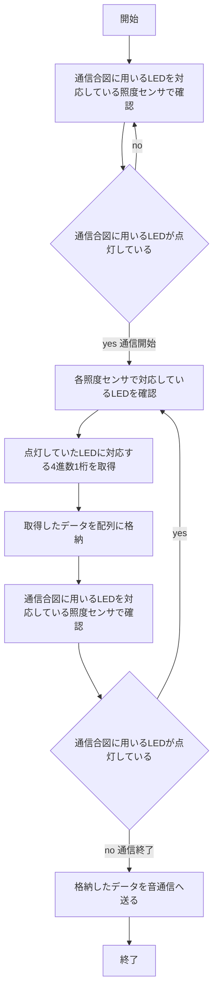
```mermaid
flowchart TD;

start["開始"];
end1["終了"]
check1["通信合図に用いるLEDを対応している照度センサで確認"]
if1{"通信合図に用いるLEDが点灯している"}
syoudo["各照度センサで対応しているLEDを確認"]
syu["点灯していたLEDに対応する4進数1桁を取得"]
kakuno["取得したデータを配列に格納"]
check2["通信合図に用いるLEDを対応している照度センサで確認"]
if2{"通信合図に用いるLEDが点灯している"}
oto["格納したデータを音通信へ送る"]

start --> check1
check1 --> if1
if1 -->|yes 通信開始| syoudo
if1 -->|no| check1
syoudo --> syu
syu --> kakuno
kakuno --> check2
check2 --> if2
if2 -->|yes| syoudo
if2 -->|no 通信終了| oto
oto --> end1
```

## 光受信2
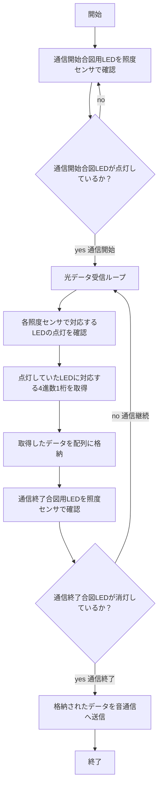
```mermaid
flowchart TD;

start["開始"]
end1["終了"]

check1["通信開始合図用LEDを照度センサで確認"]
if1{"通信開始合図LEDが点灯しているか？"}
loop["光データ受信ループ"]
syoudo["各照度センサで対応するLEDの点灯を確認"]
syu["点灯していたLEDに対応する4進数1桁を取得"]
kakuno["取得したデータを配列に格納"]
check2["通信終了合図用LEDを照度センサで確認"]
if2{"通信終了合図LEDが消灯しているか？"}
oto["格納されたデータを音通信へ送信"]

start --> check1
check1 --> if1
if1 -->|yes 通信開始| loop
if1 -->|no| check1

loop --> syoudo
syoudo --> syu
syu --> kakuno
kakuno --> check2
check2 --> if2
if2 -->|no 通信継続| loop
if2 -->|yes 通信終了| oto
oto --> end1
```

## 音送信
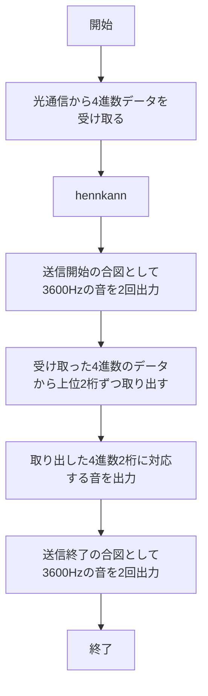
```mermaid
flowchart TD;

start["開始"];
end1["終了"]
uke["光通信から4進数データを受け取る"]
aizu1["送信開始の合図として3600Hzの音を2回出力"]
toru["受け取った4進数のデータから上位2桁ずつ取り出す"]
syutu["取り出した4進数2桁に対応する音を出力"]
aizu2["送信終了の合図として3600Hzの音を2回出力"]

start --> uke
uke --> hennkann
hennkann --> aizu1
aizu1 --> toru
toru --> syutu
syutu --> aizu2
aizu2 --> end1
```

## 音送信2
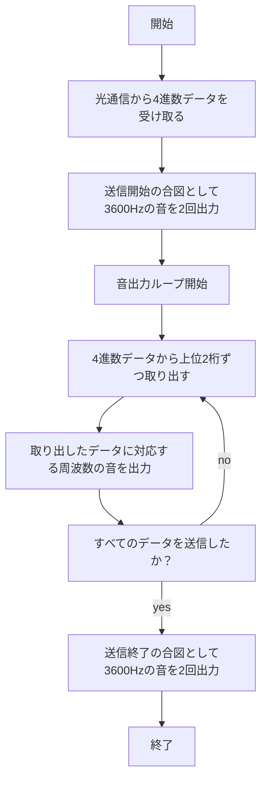
```mermaid
flowchart TD;

start["開始"];
end1["終了"]
uke["光通信から4進数データを受け取る"]
aizu1["送信開始の合図として3600Hzの音を2回出力"]
loop["音出力ループ開始"]
toru["4進数データから上位2桁ずつ取り出す"]
syutu["取り出したデータに対応する周波数の音を出力"]
check["すべてのデータを送信したか？"]
aizu2["送信終了の合図として3600Hzの音を2回出力"]

start --> uke
uke --> aizu1
aizu1 --> loop
loop --> toru --> syutu --> check
check -- no --> toru
check -- yes --> aizu2 --> end1
```

## 音受信
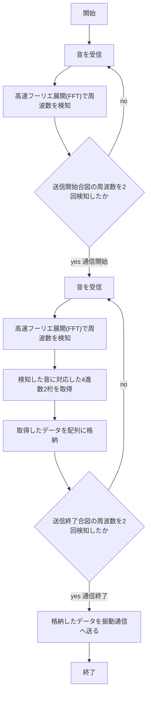
```mermaid
flowchart TD;

start["開始"];
end1["終了"]
jyusinn["音を受信"]
jyusinn2["音を受信"]
syuuha["高速フーリエ展開(FFT)で周波数を検知"]
syuuha2["高速フーリエ展開(FFT)で周波数を検知"]
if1{"送信開始合図の周波数を2回検知したか"}
syutoku["検知した音に対応した4進数2桁を取得"]
kakuno["取得したデータを配列に格納"]
if2{"送信終了合図の周波数を2回検知したか"}
sindou["格納したデータを振動通信へ送る"]

start --> jyusinn
jyusinn --> syuuha
syuuha --> if1
if1 -->|yes 通信開始| jyusinn2
if1 -->|no| jyusinn
jyusinn2 --> syuuha2
syuuha2 --> syutoku
syutoku --> kakuno
kakuno --> if2
if2 -->|yes 通信終了| sindou
if2 -->|no| jyusinn2
sindou --> end1
```

## 音受信2
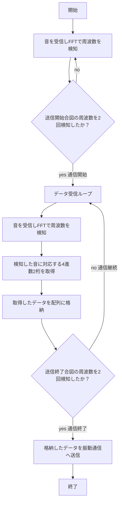
```mermaid
flowchart TD;

start["開始"]
end1["終了"]

check_start["音を受信しFFTで周波数を検知"]
if1{"送信開始合図の周波数を2回検知したか？"}

loop["データ受信ループ"]
recv["音を受信しFFTで周波数を検知"]
syutoku["検知した音に対応する4進数2桁を取得"]
kakuno["取得したデータを配列に格納"]
if2{"送信終了合図の周波数を2回検知したか？"}

sindou["格納したデータを振動通信へ送信"]

start --> check_start
check_start --> if1
if1 -->|yes 通信開始| loop
if1 -->|no| check_start

loop --> recv
recv --> syutoku
syutoku --> kakuno
kakuno --> if2
if2 -->|no 通信継続| loop
if2 -->|yes 通信終了| sindou
sindou --> end1
```

## 振動送信
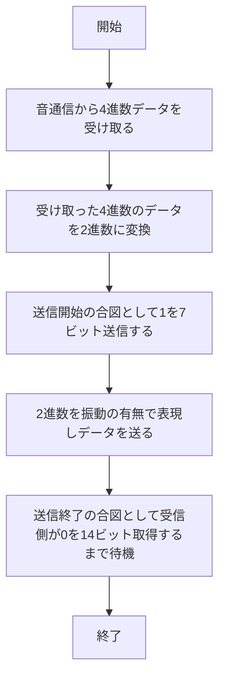
```mermaid
flowchart TD;

start["開始"];
end1["終了"]
uke["音通信から4進数データを受け取る"]
hennkann["受け取った4進数のデータを2進数に変換"]
aizu1["送信開始の合図として1を7ビット送信する"]
sousinn["2進数を振動の有無で表現しデータを送る"]
aizu2["送信終了の合図として受信側が0を14ビット取得するまで待機"]

start --> uke
uke --> hennkann
hennkann --> aizu1
aizu1 --> sousinn
sousinn --> aizu2
aizu2 --> end1
```

## 振動送信2
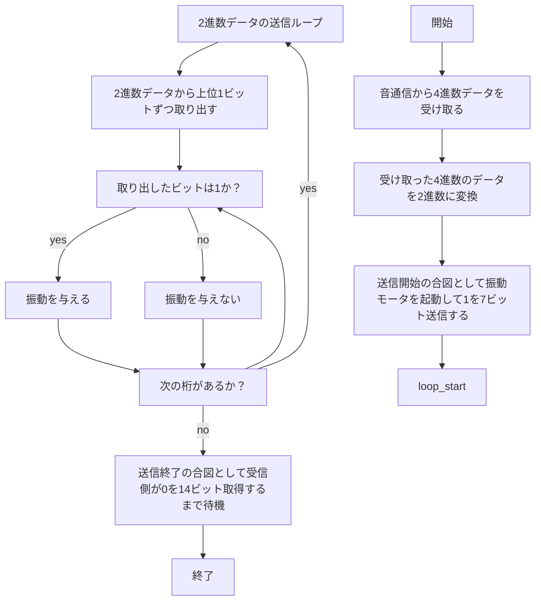
```mermaid
flowchart TD;

start["開始"]
end1["終了"]
uke["音通信から4進数データを受け取る"]
hennkann["受け取った4進数のデータを2進数に変換"]
aizu1["送信開始の合図として振動モータを起動して1を7ビット送信する"]
loop1["2進数データの送信ループ"]
toru["2進数データから上位1ビットずつ取り出す"]
judge["取り出したビットは1か？"]
on["振動を与える"]
off["振動を与えない"]
next["次の桁があるか？"]
aizu2["送信終了の合図として受信側が0を14ビット取得するまで待機"]

start --> uke
uke --> hennkann
hennkann --> aizu1
aizu1 --> loop_start
loop1 --> toru
toru --> judge
judge -->|yes| on
judge -->|no| off
on --> next
off --> next
next --> judge
next -->|yes| loop1
next -->|no| aizu2
aizu2 --> end1
```

## 振動受信
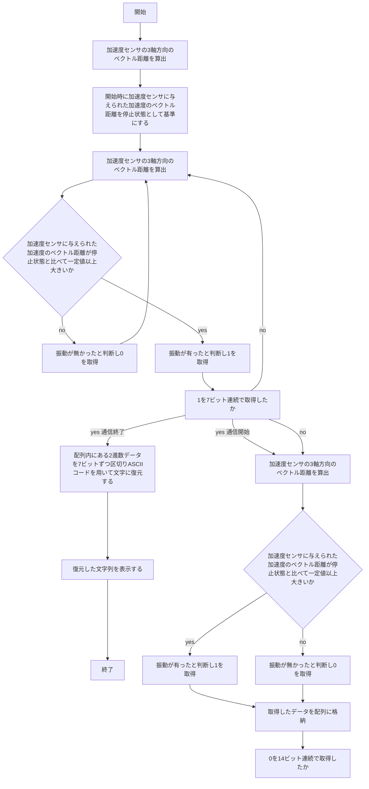
```mermaid
flowchart TD;

start["開始"];
end1["終了"]
bekutoru["加速度センサの3軸方向のベクトル距離を算出"]
kijyun["開始時に加速度センサに与えられた加速度のベクトル距離を停止状態として基準にする"]
bekutoru2["加速度センサの3軸方向のベクトル距離を算出"]
if1{"加速度センサに与えられた加速度のベクトル距離が停止状態と比べて一定値以上大きいか"}
syutoku0["振動が無かったと判断し0を取得"]
syutoku1["振動が有ったと判断し1を取得"]
if2["1を7ビット連続で取得したか"]
bekutoru3["加速度センサの3軸方向のベクトル距離を算出"]
if3{"加速度センサに与えられた加速度のベクトル距離が停止状態と比べて一定値以上大きいか"}
syutoku02["振動が無かったと判断し0を取得"]
syutoku12["振動が有ったと判断し1を取得"]
kakuno["取得したデータを配列に格納"]
if4["0を14ビット連続で取得したか"]
hukugen["配列内にある2進数データを7ビットずつ区切りASCIIコードを用いて文字に復元する"]
hyouji["復元した文字列を表示する"]

start --> bekutoru
bekutoru --> kijyun
kijyun --> bekutoru2
bekutoru2 --> if1
if1 -->|yes| syutoku1
if1 -->|no| syutoku0
syutoku0 --> bekutoru2
syutoku1 --> if2
if2 -->|yes 通信開始| bekutoru3
if2 -->|no| bekutoru2
bekutoru3 --> if3
if3 -->|yes| syutoku12
if3 -->|no| syutoku02
syutoku12 --> kakuno
syutoku02 --> kakuno
kakuno --> if4
if2 -->|yes 通信終了| hukugen
if2 -->|no| bekutoru3
hukugen --> hyouji
hyouji --> end1
```

## 振動受信2
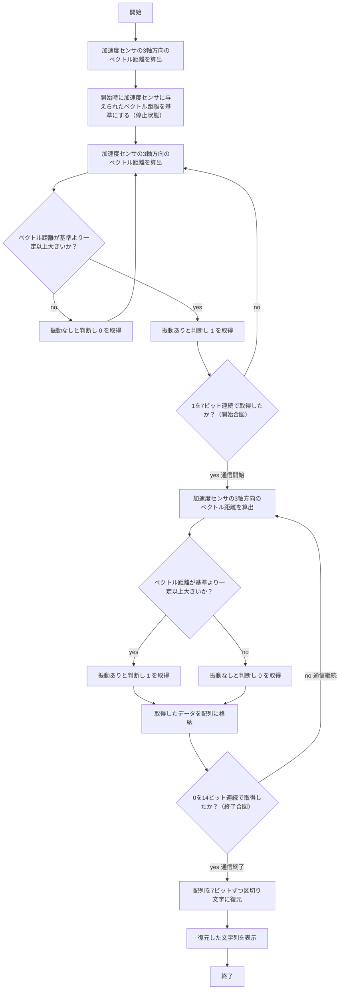
```mermaid
flowchart TD;

start["開始"]
end1["終了"]

bekutoru1["加速度センサの3軸方向のベクトル距離を算出"]
kijyun["開始時に加速度センサに与えられたベクトル距離を基準にする（停止状態）"]
bekutoru2["加速度センサの3軸方向のベクトル距離を算出"]
if1{"ベクトル距離が基準より一定以上大きいか？"}
syutoku0["振動なしと判断し 0 を取得"]
syutoku1["振動ありと判断し 1 を取得"]
if2{"1を7ビット連続で取得したか？（開始合図）"}

bekutoru3["加速度センサの3軸方向のベクトル距離を算出"]
if3{"ベクトル距離が基準より一定以上大きいか？"}
syutoku02["振動なしと判断し 0 を取得"]
syutoku12["振動ありと判断し 1 を取得"]
kakuno["取得したデータを配列に格納"]
if4{"0を14ビット連続で取得したか？（終了合図）"}

hukugen["配列を7ビットずつ区切り文字に復元"]
hyouji["復元した文字列を表示"]

start --> bekutoru1
bekutoru1 --> kijyun
kijyun --> bekutoru2
bekutoru2 --> if1
if1 -->|yes| syutoku1
if1 -->|no| syutoku0
syutoku0 --> bekutoru2
syutoku1 --> if2
if2 -->|yes 通信開始| bekutoru3
if2 -->|no| bekutoru2

bekutoru3 --> if3
if3 -->|yes| syutoku12
if3 -->|no| syutoku02
syutoku12 --> kakuno
syutoku02 --> kakuno
kakuno --> if4
if4 -->|yes 通信終了| hukugen
if4 -->|no 通信継続| bekutoru3

hukugen --> hyouji
hyouji --> end1
```