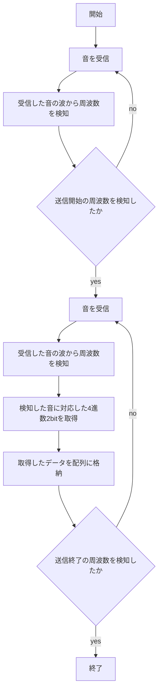
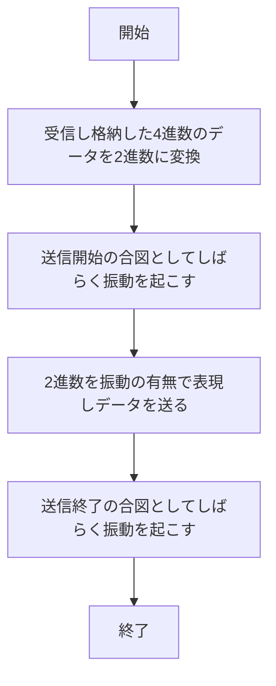

# hakkason
## 音受信

```mermaid
flowchart TD;

start["開始"];
end1["終了"]
jyusinn["音を受信"]
jyusinn2["音を受信"]
syuuha["受信した音の波から周波数を検知"]
syuuha2["受信した音の波から周波数を検知"]
if1{"送信開始の周波数を検知したか"}
syutoku["検知した音に対応した4進数2bitを取得"]
kakuno["取得したデータを配列に格納"]
if2{"送信終了の周波数を検知したか"}

start --> jyusinn
jyusinn --> syuuha
syuuha --> if1
if1 -->|yes| jyusinn2
if1 -->|no| jyusinn
jyusinn2 --> syuuha2
syuuha2 --> syutoku
syutoku --> kakuno
kakuno --> if2
if2 -->|yes| end1
if2 -->|no| jyusinn2
```

## 振動送信

```mermaid
flowchart TD;

start["開始"];
end1["終了"]
hennkann["受信し格納した4進数のデータを2進数に変換"]
aizu1["送信開始の合図としてしばらく振動を起こす"]
sousinn["2進数を振動の有無で表現しデータを送る"]
aizu2["送信終了の合図としてしばらく振動を起こす"]

start --> hennkann
hennkann --> aizu1
aizu1 --> sousinn
sousinn --> aizu2
aizu2 --> end1
```
