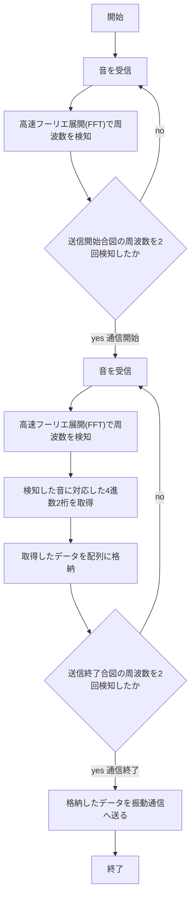
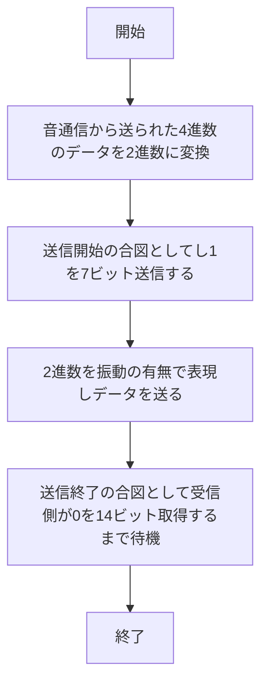
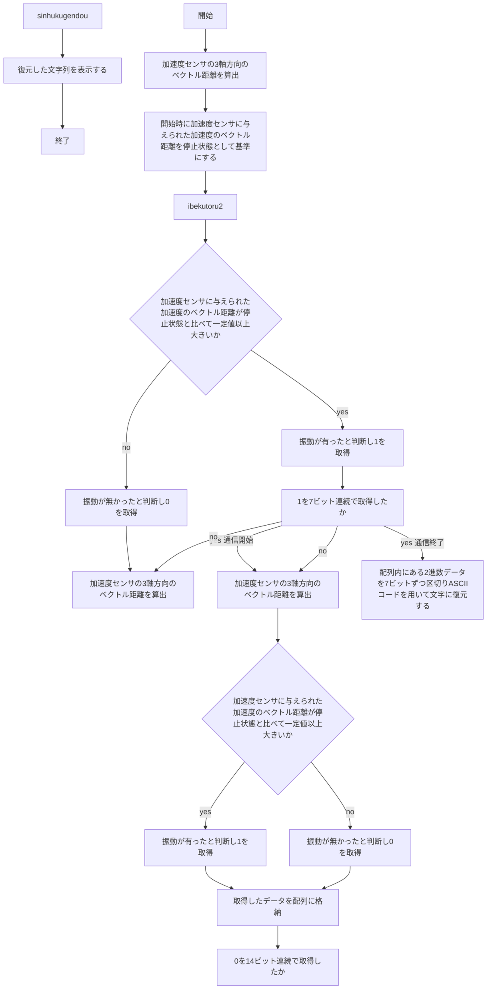

# hakkason
## 音受信

```mermaid
flowchart TD;

start["開始"];
end1["終了"]
jyusinn["音を受信"]
jyusinn2["音を受信"]
syuuha["高速フーリエ展開(FFT)で周波数を検知"]
syuuha2["高速フーリエ展開(FFT)で周波数を検知"]
if1{"送信開始合図の周波数を2回検知したか"}
syutoku["検知した音に対応した4進数2桁を取得"]
kakuno["取得したデータを配列に格納"]
if2{"送信終了合図の周波数を2回検知したか"}
sindou["格納したデータを振動通信へ送る"]

start --> jyusinn
jyusinn --> syuuha
syuuha --> if1
if1 -->|yes 通信開始| jyusinn2
if1 -->|no| jyusinn
jyusinn2 --> syuuha2
syuuha2 --> syutoku
syutoku --> kakuno
kakuno --> if2
if2 -->|yes 通信終了| sindou
if2 -->|no| jyusinn2
sindou --> end1
```

## 振動送信

```mermaid
flowchart TD;

start["開始"];
end1["終了"]
hennkann["音通信から送られた4進数のデータを2進数に変換"]
aizu1["送信開始の合図としてし1を7ビット送信する"]
sousinn["2進数を振動の有無で表現しデータを送る"]
aizu2["送信終了の合図として受信側が0を14ビット取得するまで待機"]

start --> hennkann
hennkann --> aizu1
aizu1 --> sousinn
sousinn --> aizu2
aizu2 --> end1
```

## 振動受信

```mermaid
flowchart TD;

start["開始"];
end1["終了"]
bekutoru["加速度センサの3軸方向のベクトル距離を算出"]
kijyun["開始時に加速度センサに与えられた加速度のベクトル距離を停止状態として基準にする"]
bekutoru2["加速度センサの3軸方向のベクトル距離を算出"]
if1{"加速度センサに与えられた加速度のベクトル距離が停止状態と比べて一定値以上大きいか"}
syutoku0["振動が無かったと判断し0を取得"]
syutoku1["振動が有ったと判断し1を取得"]
if2["1を7ビット連続で取得したか"]
bekutoru3["加速度センサの3軸方向のベクトル距離を算出"]
if3{"加速度センサに与えられた加速度のベクトル距離が停止状態と比べて一定値以上大きいか"}
syutoku02["振動が無かったと判断し0を取得"]
syutoku12["振動が有ったと判断し1を取得"]
kakuno["取得したデータを配列に格納"]
if4["0を14ビット連続で取得したか"]
hukugen["配列内にある2進数データを7ビットずつ区切りASCIIコードを用いて文字に復元する"]
hyouji["復元した文字列を表示する"]

start --> bekutoru
bekutoru --> kijyun
kijyun --> ibekutoru2
ibekutoru2 --> if1
if1 -->|yes| syutoku1
if1 -->|no| syutoku0
syutoku0 --> bekutoru2
syutoku1 --> if2
if2 -->|yes 通信開始| bekutoru3
if2 -->|no| bekutoru2
bekutoru3 --> if3
if3 -->|yes| syutoku12
if3 -->|no| syutoku02
syutoku12 --> kakuno
syutoku02 --> kakuno
kakuno --> if4
if2 -->|yes 通信終了| hukugen
if2 -->|no| bekutoru3
sinhukugendou --> hyouji
hyouji --> end1
```
